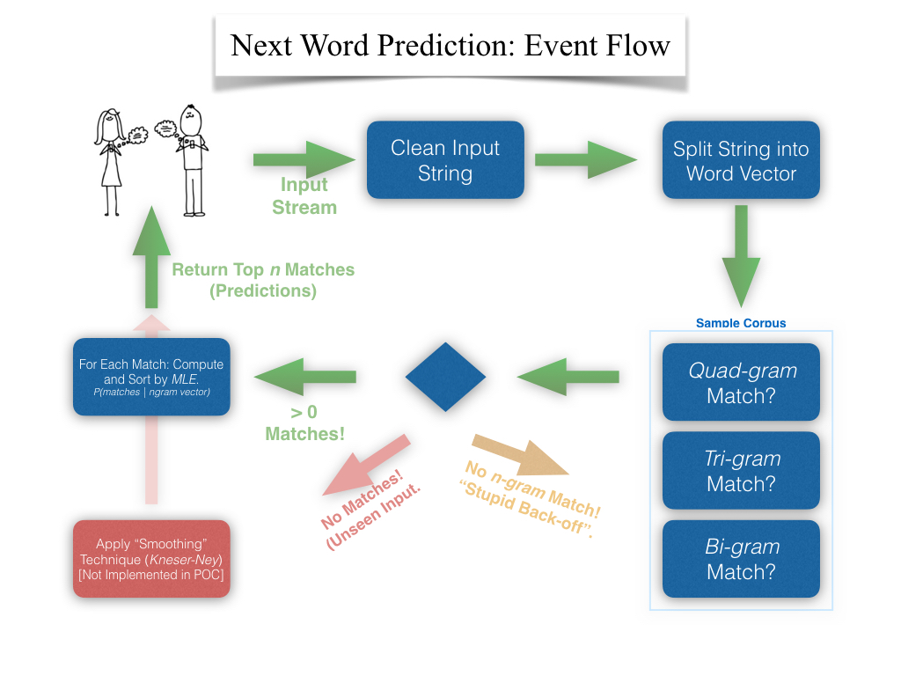

# Word! Next Word Predictor 

I built this app as part of a Capstone project for JHU's [Data Science Specialization](https://www.coursera.org/specializations/jhu-data-science). It uses *n-grams* to predict the three most probable next words as the user types. [Shiny App Demo](https://ashirwad.shinyapps.io/word/).  

# Training Data  
Industry partners  and JHU pointed us to datasets of US News, Blogs, and Twitter datasets at HC Corpora (a text web crawler).

Detailed data processing steps [are here](NextWordPredictor_Exploration.Rmd).  

# Under the Hood  

# Future Considerations  
+ Implement Kneser-Ney Smoothing  
+ Implement More Robust Backoff Model 
+ Host on a Cloud Server to Train on Larger Corpus  

[Ash Chakraborty](https://www.linkedin.com/in/ashirwadchakraborty)  
 
