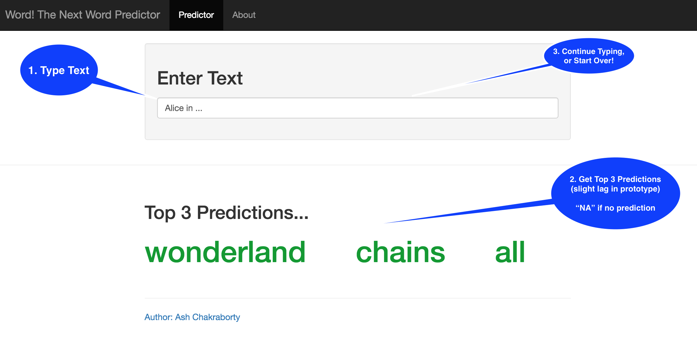
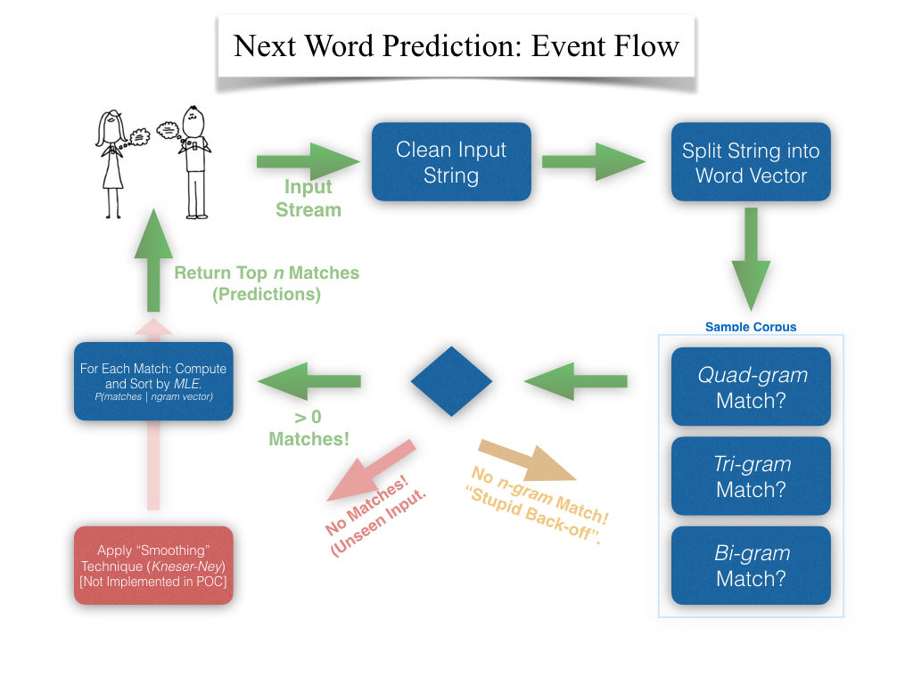

Word! The Next Word Predictor
========================================================
author: Ash Chakraborty
date: April 17, 2016

The Problem: Texting is Slow and Error Prone
========================================================

**Texting** is here to stay!  
- But! Mobile keyboard apps today either require two hands,
- or by superflous edits (think, overactive *'autocorrect'*),
- slowing down typing, and distracting the *on-the-go* texter!  

The Solution: Adaptive Typing! Reduce the Pain
=======================================================

So, speed up this process: *Predict the next word* as the texter types!   

**Word!**, is a proof of concept that demonstrates how this may be achieved, ideally on a mobile or other _on-the-go_ device.  **[Click to see working protoype](https://ashirwad.shinyapps.io/word/)** 

Advantages:  
+ Increase Typing Speed  
+ Decrease Typed Errors/Edit Times  
+ Many Ways to Improve Speed by Personalizing to User's Texting Habits  

Word! The Next Word Predictor
========================================================

   

+ Cleans Input  
+ _Tri-gram_ Driven Prediction (_note: slight lag in prototype_)  
+ Returns Top 3 Predictions  

Word! The Next Word Predictor: Under the Hood
========================================================

 

Word! The Next Word Predictor: Future
========================================================  
left: 75%
  
# ___

Potential Enhancements:   
+ Improve predictions by implementing _smoothing techniques_ (to account for untrained text input), and other NLP techniques  
+ Improve predictions by personalizing the _n-gram_ training to texter's word universe  
+ Mobile app. implementation  
+ Scale performance on the cloud for fast predictions  

***  
# ___  

+ [Author Bio](https://www.linkedin.com/in/ashirwadchakraborty)  
+ [App. Demo](https://ashirwad.shinyapps.io/word/)  
+ [App. Code](https://github.com/ashirwad08/typed-word-predictor)  
+ [Author Blog](https://theintentionalmachine.net/)

